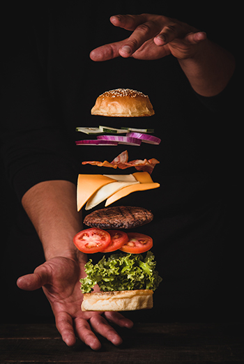

# ✨✨ The BurgerBuilder ✨✨



<sub><sup>Photo by Pablo Merchán Montes on Unsplash</sup></sub>
- - -

**Link:** [https://my-burgerbuilder.firebaseapp.com](https://my-burgerbuilder.firebaseapp.com)

**About:** It's a **React.js** App (based on ```facebook/create-react-app bundle```). Undergo authentication (**[Firebase API](https://firebase.google.com)**), build burger of your dreams and confirm your order 👌 (**Redux** and **Chart.js**). You can see your orders on a tab of 'orders'...and so on 😊

**The table of the used core tools:**

|         React.js        |        Redux       |        Chart.js        |     Axios     |
|:-----------------------:|:------------------:|:----------------------:|:-------------:|
| react: 16.4.2           | redux: 4.0.0       | chart.js: 2.7.2        | axios: 0.18.0 |
| react-dom: 16.4.2       | react-redux: 5.0.7 | react-chartjs-2: 2.7.4 |       -       |
| react-router-dom: 4.3.1 | redux-thunk: 2.3.0 |            -           |       -       |

**Instruction:** If you want open project in dev-mode, just clone repo and do it:
```
yarn install
yarn start
```
- - -
Mail for communication: <ProUnebit@yandex.ru>
